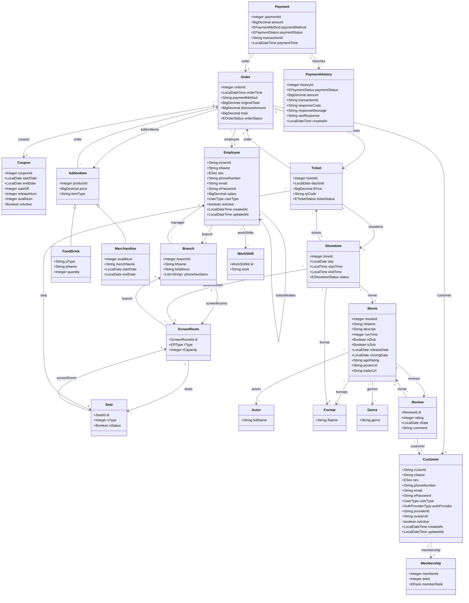

# DATH-CMS-BE UML Class Diagram

Mô hình lớp (UML Class Diagram) của các core entities trong database của hệ thống DATH-CMS-BE. Đã cập nhật mới nhất kèm các Enum tách rời và tích hợp Coupon vào Order.

